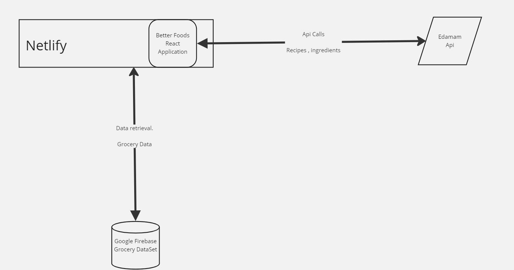

This diagram depicts the core components of our Better Foods site which assists users in meal planning based on budget and dietary preferences. The application will be hosted on Netlify, which serves as a React-based front end. User interactions with the application, such as inputting their budget constraints and dietary preferences, will trigger API requests to the Edamam API. This will provide recipe and nutritional information. The application will interact with a Google Firestore database, hosted on Google Cloud, which will store and manage our curated list of local grocery prices. This database will allow us to calculate the cost of ingredients for a meal.

